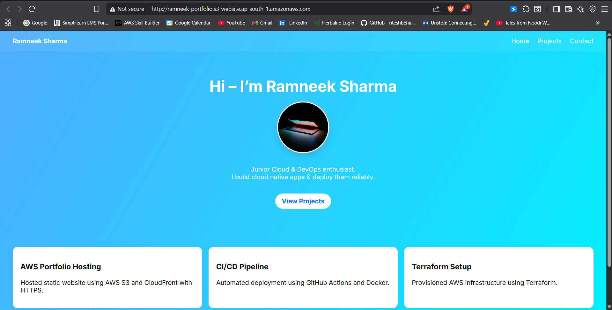
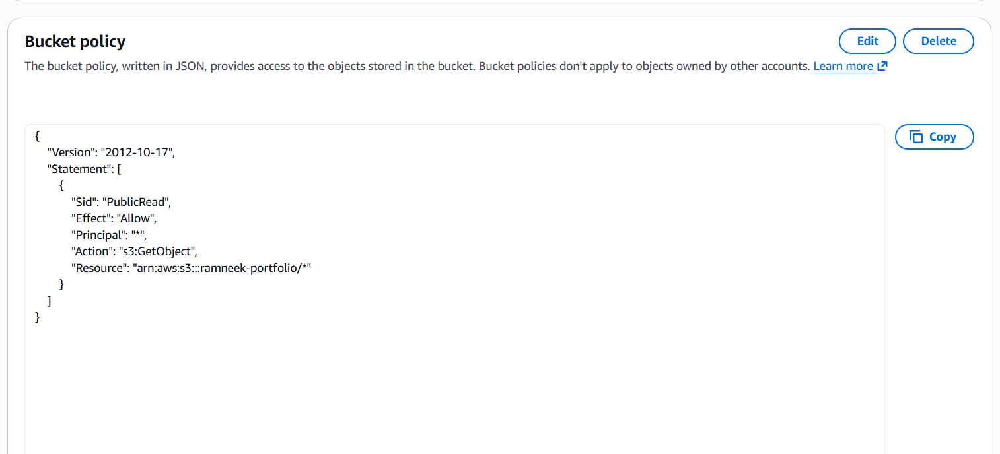
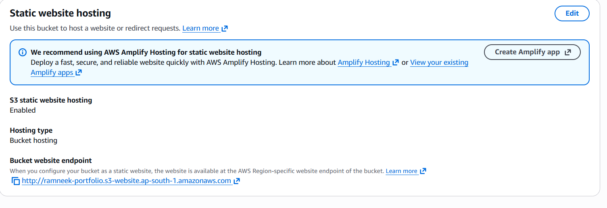

## 📸 Screenshots

### 🔹 Live Website

### 🔹 S3 Hosting Setup

### 🔹 Bucket Policy

### 🔹 S3 Endpoint Link

# Portfolio Website

This repository contains my personal portfolio website built using HTML, CSS, and JavaScript.

## 🚀 Features

* Responsive design
* Clean and modern UI
* Smooth scrolling and basic animations

## ☁️ Deployment

\## 🌐 Deployment (Updated)

The website is deployed using:

\- AWS S3 (Static Hosting)

\- AWS CloudFront (HTTPS \& CDN).

## 🛠️ Technologies Used

* HTML
* CSS
* JavaScript
* AWS S3
  
## 🌍 Live Website
http://ramneek-portfolio.s3-website.ap-south-1.amazonaws.com/
## 📂 Project Structure

index.html
style.css
script.js
screenshots/

